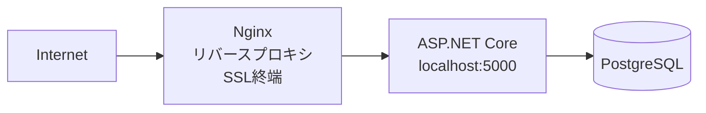

# Micon Lottery System

近畿大学マイコン部が作成した抽選システム

## 構成

- **Micon.LotterySystem** - ASP.NET Core Web API（バックエンド）
- **Micon.LotterySystem.Desktop** - Avaloniaデスクトップアプリ（レシート印刷用）
- **Micon.LotterySystem.Aspire** - .NET Aspire開発環境オーケストレーション
- **micon.lotterysystem.client** - Svelteフロントエンド

## ディレクトリ構造

```
Micon.LotterySystem/
├── .github/
│   └── workflows/
│       ├── deploy.yml              # Webアプリデプロイ
│       └── deploy-desktop.yml      # デスクトップアプリデプロイ
├── .deploy/
│   └── miconlottery.service        # systemdサービス定義
├── Micon.LotterySystem/            # バックエンド
│   ├── Controllers/                # APIコントローラー
│   ├── Models/                     # データモデル
│   ├── Services/                   # ビジネスロジック
│   ├── Hubs/                       # SignalRハブ
│   ├── Migrations/                 # DBマイグレーション
│   ├── micon.lotterysystem.client/ # フロントエンド (SvelteKit)
│   └── appsettings.json
├── Micon.LotterySystem.Desktop/    # デスクトップアプリ
│   ├── Views/                      # Avaloniaビュー
│   ├── ViewModels/                 # MVVM ViewModel
│   ├── Models/                     # データモデル
│   ├── Services/                   # プリンターサービス等
│   ├── Setting/                    # 設定クラス
│   └── appsettings.json
├── Micon.LotterySystem.Aspire/     # 開発環境オーケストレーション
│   ├── Micon.LotterySystem.Aspire.AppHost/
│   └── Micon.LotterySystem.Aspire.ServiceDefaults/
└── Micon.LotterySystem.sln
```

## 技術スタック

### バックエンド
- .NET 9.0
- ASP.NET Core
- Entity Framework Core
- PostgreSQL

### フロントエンド
- SvelteKit
- TypeScript

### デスクトップアプリ
- .NET 9.0
- Avalonia UI

### 開発環境（.NET Aspire）
- .NET Aspire 9.0

## 開発環境

### 前提ソフトウェア

| ソフトウェア | バージョン | 備考 |
|-------------|-----------|------|
| [.NET SDK](https://dotnet.microsoft.com/download) | 9.0 | `dotnet --version`で確認 |
| [Node.js](https://nodejs.org/) | 20+ | `node --version`で確認（npm同梱） |
| npm | 10+ | `npm --version`で確認 |
| [Docker Desktop](https://www.docker.com/products/docker-desktop) | 最新 | Aspire用コンテナ実行環境 |
| [Git](https://git-scm.com/) | 最新 | `git --version`で確認 |

### インストール確認

```bash
dotnet --version    # 9.0.x
node --version      # v20.x.x
npm --version       # 10.x.x
docker --version    # Docker version ...
git --version       # git version ...
```

### セットアップ

```bash
# リポジトリをクローン
git clone https://github.com/kindai-micon/Micon.LotterySystem.git
cd Micon.LotterySystem

# .NETの依存関係を復元
dotnet restore

# フロントエンドの依存関係をインストール
cd Micon.LotterySystem/micon.lotterysystem.client
npm install
cd ../..

# Aspire AppHostを実行（PostgreSQL含む）
dotnet run --project Micon.LotterySystem.Aspire/Micon.LotterySystem.Aspire.AppHost

# デスクトップアプリも同時に起動する場合
dotnet run --project Micon.LotterySystem.Aspire/Micon.LotterySystem.Aspire.AppHost -- --desktop
```

Aspireダッシュボードが自動的に開き、各サービスの状態を確認できます。

### デスクトップアプリ

```bash
# デスクトップアプリを実行
dotnet run --project Micon.LotterySystem.Desktop
```

## 設定ファイル

### Webアプリ（appsettings.json）

`Micon.LotterySystem/appsettings.json`:

```json
{
  "ConnectionStrings": {
    "lottery-db": "Host=localhost;Database=lottery;Port=5432;Username=postgres;Password=your_password"
  },
  "JwtSettings": {
    "SecretKey": "YourSuperSecretKeyForJwtTokenGeneration_Minimum32Characters!",
    "Issuer": "Micon.LotterySystem",
    "Audience": "Micon.LotterySystem.Clients",
    "AccessTokenExpirationMinutes": 15,
    "RefreshTokenExpirationDays": 30
  },
  "LotteryBaseUrl": "http://localhost:5000",
  "UseHttpsForQrCode": false,
  "Cors": {
    "AllowedOrigins": ["http://localhost:5000"]
  }
}
```

| 設定項目 | 説明 |
|---------|------|
| `ConnectionStrings:lottery-db` | PostgreSQL接続文字列 |
| `JwtSettings:SecretKey` | JWT署名用秘密鍵（32文字以上） |
| `JwtSettings:Issuer` | JWT発行者 |
| `JwtSettings:Audience` | JWT対象 |
| `LotteryBaseUrl` | 抽選画面のベースURL |
| `UseHttpsForQrCode` | QRコードURLでHTTPSを使用するか |
| `Cors:AllowedOrigins` | CORS許可オリジン |

### デスクトップアプリ（appsettings.json）

`Micon.LotterySystem.Desktop/appsettings.json`:

```json
{
  "Backend": {
    "Url": "http://localhost:5000"
  },
  "Printer": {
    "PrinterName": "POS-80C",
    "DocumentName": "抽選券印刷",
    "CutEnabled": true
  },
  "ReceiptLayout": {
    "PaperWidthPx": 576,
    "QrSizePx": 220,
    "MarginLeft": 24,
    "MarginRight": 24,
    "MarginTop": 24,
    "MarginBottom": 24,
    "TitleFontSize": 28,
    "NumberFontSize": 42,
    "BodyFontSize": 22,
    "FooterFontSize": 18,
    "Threshold": 160,
    "WarningLines": [
      "本券は大切に保管してください",
      "抽選時までお持ちください"
    ],
    "FooterText": "Micon Lottery System"
  }
}
```

| 設定項目 | 説明 |
|---------|------|
| `Backend:Url` | バックエンドAPIのURL |
| `Printer:PrinterName` | プリンター名 |
| `Printer:CutEnabled` | 自動カット有効/無効 |
| `ReceiptLayout:*` | レシートレイアウト設定 |

## データベース構築

### PostgreSQLのセットアップ

```bash
# PostgreSQLに接続
sudo -u postgres psql

# データベース作成
CREATE DATABASE my_db;

# ユーザー作成
CREATE USER postgres WITH PASSWORD 'your_password';
GRANT ALL PRIVILEGES ON DATABASE my_db TO postgres;
```

### マイグレーション

```bash
# マイグレーションの作成
dotnet ef migrations add InitialCreate --project Micon.LotterySystem

# データベースに適用
dotnet ef database update --project Micon.LotterySystem
```

## 本番環境

### 構成



- **Webサーバー**: Nginx（リバースプロキシ、SSL終端）
- **アプリケーションサーバー**: ASP.NET Core (systemd)
- **データベース**: PostgreSQL
- **SSL証明書**: Let's Encrypt (Certbot)
- **デプロイ先**: `/var/www/miconlottery/publish`
- **URL**: https://lottery.kindai-micon.club

### デプロイフロー

1. `release`ブランチにマージ
2. GitHub Actionsが自動的にビルド・デプロイ
3. systemdサービスが再起動

### サービス管理

```bash
# アプリケーションサービス
sudo systemctl status miconlottery    # 状態確認
sudo systemctl restart miconlottery   # 再起動
sudo journalctl -u miconlottery -f    # ログ確認

# Nginx
sudo systemctl status nginx           # 状態確認
sudo nginx -t                         # 設定テスト
sudo systemctl reload nginx           # 設定再読み込み

# SSL証明書更新
sudo certbot renew                    # 証明書更新
```

## デプロイ

### Webアプリ
`release`ブランチにマージすると自動的にデプロイされます。

### デスクトップアプリ
タグをプッシュするとGitHub Releasesに公開されます。

```bash
git tag v0.1.0
git push origin v0.1.0
```

## ライセンス

[MIT License](LICENSE.txt)
